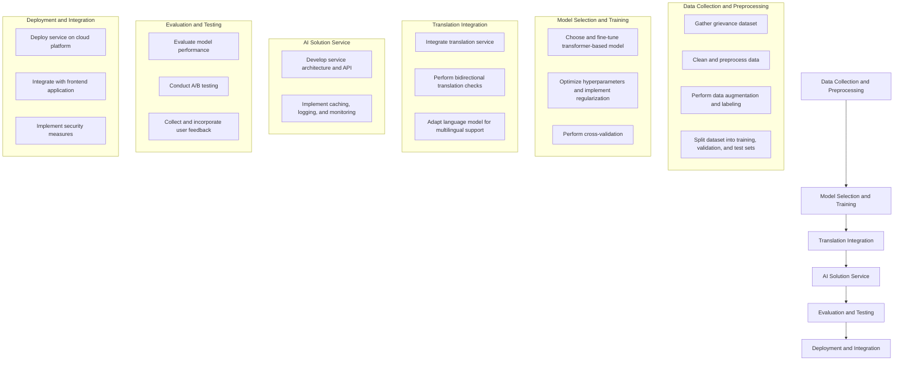

# GAI-GRMS: Generative AI-Driven Grievance Registration and Management System

The government of Navistria, a human-colonized country on Mars, seeks to modernize its grievance redressal mechanism to enhance citizen engagement and streamline issue resolution. This project aims to develop a Generative AI-Driven Grievance Registration and Management System (GAI-GRMS) leveraging state-of-the-art conversational AI, image processing, and advanced analytics to ensure seamless and effective grievance resolution. 

## Table of Contents
- [Functional Requirements](#functional-requirements)
- [Solution Architecture](#solution-architecture)
- [Setup and Installation](#setup-and-installation)
- [Frontend Implementation](#frontend-implementation)
- [Backend Implementation](#backend-implementation)
- [Usage](#usage)
- [Contributing](#contributing)
- [License](#license)

## Functional Requirements
1. **Conversational AI for Grievance Filing**
   - A text-based conversational AI system capable of interacting with users in Hindi and English to file grievances.
   - Multi-threaded conversations, enabling assignment to multiple Grievance Redressal Officers (GROs).
   - Dynamic understanding and response for simplified grievance filing.

2. **Speech Interaction for Task Completion**
   - Enable end-users to speak in Hindi and English.
   - Integration of speech-to-text and text-to-speech functionalities for an intuitive user experience.

3. **Image and Document Processing**
   - Allow users to upload images relevant to their grievances.
   - AI-based generation of an overall description of the image, identification of issues, and OCR for parsing documents.

4. **Automated Mapping and Categorisation**
   - High-precision automated mapping of complaints to relevant government departments.
   - Automatic categorisation of grievances tailored for users and grievance officers.

5. **AI-Powered Resolution and Insights**
   - Recommendation engines providing solution suggestions based on past grievances.
   - Classification and recommendation models to improve grievance resolution efficiency.

6. **Advanced Data Analysis and Documentation**
   - Support for structured, semi-structured, and unstructured data from diverse sources.
   - Root cause analysis using large language models (LLMs).
   - Auto-population of Action Taken Reports (ATRs).
   - OCR support for converting paper-based grievances into digital formats, with language translation.

7. **Grievance Summarisation and Simplification**
   - Summarisation of detailed grievances for easier review by grievance officers and appellate bodies.
   - Display of summarised grievances on respective interfaces for GROs or appellate users.

8. **Enhanced Citizen Interaction Tools**
   - Agentic user interaction tools for simplified communication and submission of grievances.
   - Natural language search functionality for easy access to grievance-related information for GROs.

## Solution Architecture
### 1. Frontend
- **Grievance Filing**: Web interface supporting text and voice input.
- **Grievance List**: Display filed grievances and track statuses.

### 2. Backend
- **API Layer**: RESTful APIs to handle requests from the frontend.
- **Database**: Storage for user data, grievances, and system logs.
- **AI Services**: Microservices for conversational AI, image processing, OCR, and recommendation engines.
- **Analytics Engine**: For data analysis, root cause analysis, and summarisation.

### 3. Integration Services
- **Speech-to-Text and Text-to-Speech**: Integration with third-party services.
- **Translation Services**: Translation of grievances into multiple languages.

### 4. Security
- **Authentication and Authorization**: Secure access to the system.
- **Data Encryption**: Protecting sensitive data in transit and at rest.

## Setup and Installation
### Prerequisites
- Python 3.8+
- Node.js and npm
- Flask
- SQLAlchemy
- NLTK
- OpenCV
- Tesseract OCR
- Google Cloud Speech-to-Text
- Transformers (Hugging Face)

### Installation
1. **Backend Setup**:
   ```bash
   cd Backend
   python -m venv venv
   source venv/bin/activate  # On Windows: venv\Scripts\activate
   pip install -r requirements.txt
   flask run
2. **Frontend Setup**:
    ```bash
    cd Frontend
    run index.html

## Candidate Questions

### 1. Machine Learning Tasks for Grievance Management System

#### 1. Text Classification for Grievance Categorization
- **Task Description**: Classify the incoming grievances into predefined categories (e.g., Maintenance, Security, Billing) to streamline the grievance handling process.
- **Input**: Text description of the grievance.
- **Output**: Predicted category of the grievance (e.g., Maintenance, Security, Billing).
- **Additional Resources**: 
  - **Vector Store**: Pre-trained word embeddings (e.g., GloVe, Word2Vec).
  - **Train Time Only Resources**: Labeled grievance dataset for supervised learning.
  - **Test Time Only Resources**: Tokenizer for converting text to vectors, dictionary of categories.
- **Deliverable**: A document containing model architecture, training dataset, preprocessing steps, and evaluation metrics.

#### 2. Named Entity Recognition (NER) for Key Information Extraction
- **Task Description**: Identify and extract key entities (e.g., dates, locations, people) from the grievance text to automate data entry and enhance search functionality.
- **Input**: Text description of the grievance.
- **Output**: Extracted entities (e.g., "Location: Building 5", "Date: 2025-01-24").
- **Additional Resources**: 
  - **Vector Store**: Pre-trained BERT embeddings.
  - **Train Time Only Resources**: Annotated dataset with named entities.
  - **Test Time Only Resources**: NER model, dictionary of entity types.
- **Deliverable**: A document detailing the NER model, training data, annotation guidelines, and performance metrics.

#### 3. Sentiment Analysis for Grievance Priority
- **Task Description**: Analyze the sentiment of the grievance text to determine the urgency and priority level (e.g., high, medium, low).
- **Input**: Text description of the grievance.
- **Output**: Sentiment score and priority level (e.g., "Sentiment: Negative", "Priority: High").
- **Additional Resources**: 
  - **Vector Store**: Sentiment-specific word embeddings.
  - **Train Time Only Resources**: Labeled sentiment dataset.
  - **Test Time Only Resources**: Sentiment model, dictionary of sentiment scores.
- **Deliverable**: A document describing the sentiment analysis model, training and testing data, and evaluation results.

#### 4. Image Classification for Grievance Type Identification
- **Task Description**: Classify images attached to grievances to identify the type of issue (e.g., leak, damage, vandalism).
- **Input**: Image files attached to the grievance.
- **Output**: Predicted image category (e.g., Leak, Damage, Vandalism).
- **Additional Resources**: 
  - **Vector Store**: Pre-trained image feature extractor (e.g., ResNet, VGG).
  - **Train Time Only Resources**: Labeled image dataset.
  - **Test Time Only Resources**: Image classification model, dictionary of image categories.
- **Deliverable**: A document including model architecture, training process, image preprocessing steps, and evaluation metrics.

#### 5. Speech-to-Text for Voice Grievance Submission
- **Task Description**: Convert voice recordings of grievances into text format to facilitate text processing and storage.
- **Input**: Audio recordings of grievance descriptions.
- **Output**: Transcribed text of the grievance.
- **Additional Resources**: 
  - **Vector Store**: Audio features extractor (e.g., MFCC).
  - **Train Time Only Resources**: Labeled audio dataset.
  - **Test Time Only Resources**: Speech-to-text model, language model for transcription.
- **Deliverable**: A document containing details about the speech-to-text model, training data, feature extraction methods, and performance analysis.
### 2. Working Implementation for AI Solution Generation

#### Task Description
Generate AI-based solutions for grievances based on their descriptions and categories. The solution should be able to generate responses in multiple languages.

#### Implementation
Here's a working implementation using a pre-trained GPT-2 model and a translation service.

**Import Libraries**:
```
python
from transformers import pipeline
from translate import Translator
import re

# Initialize AI Solution Service
class SolutionService:
    def __init__(self):
        # Use a more advanced model for better responses
        self.generator = pipeline('text-generation', model='gpt2-large')
        self.solution = "No responses available"
        self.translator = Translator(to_lang='en')  # Default to English

    def get_solution_suggestion(self, description, category, language='en'):
        prompt = f"Please provide a suitable solution or suggestion based on past similar grievances and best practices for Grievance Description: {description}\nCategory: {category}\n"

        # Translate prompt to the target language if it's not English
        if language != 'en':
            translator = Translator(to_lang=language)
            translated_prompt = translator.translate(prompt)
        else:
            translated_prompt = prompt
        
        response = self.generator(translated_prompt, max_length=150, num_return_sequences=1)
        generated_text = response[0]['generated_text'].strip()

        # Remove the prompt from the generated text using regex
        self.solution = re.sub(re.escape(translated_prompt), '', generated_text).strip()

        # Translate the solution back to the specified language if it's not English
        if language != 'en':
            translator = Translator(to_lang=language, from_lang='en')
            self.solution = translator.translate(self.solution)
        
        return self.solution

# Create an instance of the SolutionService
solution_service = SolutionService()
# Test the AI Solution Service
description = "The security guard is not present at the gate"
category = "Security"
language = 'hi'  # Hindi

# Generate the AI solution
solution = solution_service.get_solution_suggestion(description, category, language)
print("Generated AI Solution:", solution)
```
### 3. Extended Approach for AI Solution Generation (3 Months)

#### a. Writeup on the Approach

If given 3 months to work on the AI Solution Generation task, I would take a more comprehensive and robust approach to ensure the solution is not only functional but also scalable, maintainable, and optimized for performance. Here is the detailed plan:

1. **Data Collection and Preprocessing (Month 1)**:
    - **Data Gathering**: Collect a large and diverse dataset of grievances from multiple sources.
    - **Data Cleaning**: Remove noise, duplicates, and irrelevant data. Normalize text for consistency.
    - **Data Augmentation**: Use techniques like synonym replacement, paraphrasing, and back-translation to enhance the dataset.
    - **Labeling**: Ensure accurate labeling of grievances for supervised learning.
    - **Data Splitting**: Split the dataset into training, validation, and test sets.

2. **Model Selection and Training (Month 2)**:
    - **Model Selection**: Choose a state-of-the-art transformer-based model like GPT-3 or T5.
    - **Fine-Tuning**: Fine-tune the selected model on the grievance dataset.
    - **Hyperparameter Tuning**: Optimize hyperparameters for better performance.
    - **Regularization**: Implement techniques to prevent overfitting and improve generalization.
    - **Cross-Validation**: Perform cross-validation to ensure model robustness.

3. **Translation Integration (Month 2)**:
    - **Translation Service Integration**: Use a high-quality translation API (e.g., Google Translate) for multilingual support.
    - **Bidirectional Translation**: Ensure accurate translation of prompts and responses by implementing bidirectional translation checks.
    - **Language Model Adaptation**: Adapt the model to handle multiple languages efficiently.

4. **Building the AI Solution Service (Month 3)**:
    - **Service Architecture**: Design a scalable and modular architecture for the AI solution service.
    - **API Development**: Develop a RESTful API for generating AI solutions.
    - **Caching Mechanism**: Implement caching to improve response times and reduce API load.
    - **Logging and Monitoring**: Set up logging and monitoring for tracking performance and identifying issues.

5. **Evaluation and Testing (Throughout the 3 Months)**:
    - **Performance Evaluation**: Evaluate model performance using metrics like accuracy, BLEU score, and user satisfaction.
    - **A/B Testing**: Conduct A/B testing to compare different model versions and improvements.
    - **User Feedback Loop**: Collect and incorporate user feedback to refine the model.

6. **Deployment and Integration (Month 3)**:
    - **Deployment Strategy**: Deploy the AI solution service on a cloud platform (e.g., AWS, Azure).
    - **Scalability**: Ensure the solution is scalable to handle high traffic and concurrent requests.
    - **Integration with Frontend**: Integrate the solution with the frontend application for a seamless user experience.
    - **Security Measures**: Implement security measures to protect user data and ensure GDPR compliance.

#### b. Flow Chart or Architectural Diagram for 3-Month Implementation

#### Month 1: Data Collection and Preprocessing
- **Week 1**: Gather grievance dataset from multiple sources.
- **Week 2**: Clean and preprocess data.
- **Week 3**: Perform data augmentation and labeling.
- **Week 4**: Split dataset into training, validation, and test sets.

#### Month 2: Model Selection, Training, and Translation Integration
- **Week 1**: Choose and fine-tune the transformer-based model.
- **Week 2**: Optimize hyperparameters and implement regularization.
- **Week 3**: Integrate translation service for multilingual support.
- **Week 4**: Perform cross-validation and language model adaptation.

#### Month 3: Service Development, Evaluation, Testing, and Deployment
- **Week 1**: Develop the AI solution service architecture and API.
- **Week 2**: Implement caching, logging, and monitoring.
- **Week 3**: Conduct performance evaluation, A/B testing, and collect user feedback.
- **Week 4**: Deploy the service on a cloud platform and integrate with the frontend application.

#### Architectural Diagram


### 4. Comparison of Quick Solution and Extended 3-Month Approach

#### a. Writeup on the Approach

When comparing a quick solution with a more comprehensive 3-month approach, several factors come into play, including design decisions, architectural considerations, training paradigms, inference time, and compute resources. Here’s a detailed comparison:

| Factor                        | Quick Solution (Hackathon)                                     | Extended 3-Month Approach                                            |
|-------------------------------|----------------------------------------------------------------|---------------------------------------------------------------------|
| **Design Decisions**          | Simple, fast implementation, minimal features                  | Scalable, modular design, robust features, focus on maintainability |
| **Architectural Considerations** | Basic service architecture, single-node deployment            | Microservices architecture, multi-node deployment, cloud integration|
| **Training Paradigms**        | Fine-tune pre-trained model with limited dataset               | Fine-tune state-of-the-art models with large, diverse datasets      |
| **Inference Time Considerations** | Minimal optimizations, focus on functionality                  | Optimized inference, caching mechanisms, load balancing             |
| **Compute Resources Expected** | Limited compute resources, single GPU/CPU                      | High compute resources, multiple GPUs/CPUs, cloud-based resources   |
| **Data Collection**           | Limited data, basic cleaning and preprocessing                 | Extensive data collection, advanced cleaning, preprocessing, augmentation|
| **Model Selection**           | Use pre-trained models like GPT-2                              | Use state-of-the-art models like GPT-3 or T5                        |
| **Evaluation and Testing**    | Basic evaluation, limited testing                              | Comprehensive evaluation, cross-validation, A/B testing             |
| **Translation Integration**   | Basic translation service integration                          | High-quality bidirectional translation with API                     |
| **Deployment Strategy**       | Basic deployment on a local server or simple cloud setup       | Scalable deployment on cloud platforms (e.g., AWS, Azure)           |
| **Logging and Monitoring**    | Minimal logging and monitoring                                 | Extensive logging, monitoring, and alerting mechanisms              |
| **Security Measures**         | Basic security measures                                        | Advanced security protocols, GDPR compliance                        |
| **User Feedback Integration** | Limited user feedback                                          | Continuous feedback loop for model refinement                       |

#### Benefits of the Extended Approach

1. **Scalability and Performance**:
    - The extended approach ensures that the solution is scalable and can handle high traffic and concurrent requests.
    - Optimized inference times and caching mechanisms improve response times and overall performance.

2. **Robustness and Maintainability**:
    - A modular and microservices-based architecture enhances the maintainability and robustness of the system.
    - Comprehensive logging and monitoring facilitate easier troubleshooting and maintenance.

3. **Quality and Accuracy**:
    - Fine-tuning state-of-the-art models with extensive datasets ensures higher accuracy and relevance of the generated solutions.
    - Cross-validation and A/B testing improve the model's robustness and reliability.

4. **Multilingual Support**:
    - High-quality bidirectional translation ensures accurate and consistent multilingual support.
    - Language model adaptation enhances the model's ability to handle multiple languages efficiently.

5. **Security and Compliance**:
    - Implementing advanced security measures ensures the protection of user data and compliance with regulations like GDPR.
    - Secure deployment on cloud platforms adds an extra layer of security and reliability.

6. **User Feedback Integration**:
    - A continuous feedback loop allows for the incorporation of user feedback, leading to iterative improvements and higher user satisfaction.
